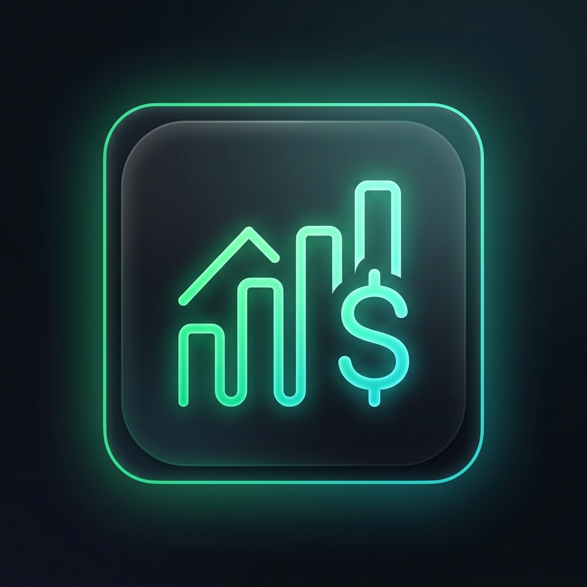

# 💰 SmartCashflow

> **Smart Sector Expense & Multi-Account Income Tracker with Multi-Tenant MySQL & Standalone SQLite Local Storage**



[](https://www.python.org/)
[](https://www.mysql.com/)
[](https://dexie.org/)
[](LICENSE)

---

## ⚡ Quick Start

Run the entire application (Backend REST API + Frontend UI) with a single command:

```bash
# Option 1: One-Click Shell Script (macOS / Linux)
./run_app.sh

# Option 2: Cross-Platform Python Launcher (Windows / macOS / Linux)
python3 run.py
```

- **Frontend Web UI**: [http://localhost:8000](http://localhost:8000)
- **Backend REST Gateway**: [http://localhost:8081](http://localhost:8081)

---

## 📁 Restructured Project Organization

```
expense_tracker/
├── assets/                  # Logos and visual brand assets
├── config/                  # Configuration files
│   ├── config.toml          # Central application settings (ports, hosts, defaults)
│   └── mysql_config.json    # MySQL connection configuration
├── css/                     # Glassmorphic UI styles
│   └── styles.css
├── docs/                    # Complete Project Documentation
│   ├── RUNNING.md           # Step-by-step instructions on running the app
│   ├── ARCHITECTURE.md      # Technical architecture, sync pipelines & security
│   └── API_REFERENCE.md     # Full REST API endpoint reference
├── js/                      # Frontend JavaScript modules
│   ├── app.js               # Main application controller
│   ├── auth.js              # Authentication, session manager & Google OAuth
│   ├── charts.js            # Chart.js analytics & visual trends
│   ├── currency.js          # Multi-currency formatter & exchange rates
│   ├── db.js                # IndexedDB (Dexie.js) offline database layer
│   └── sync.js              # Dual-sync pipeline (IndexedDB <-> Backend)
├── server/                  # Grouped Python Backend Servers
│   ├── __init__.py          # Package initializer
│   ├── mysql_server.py      # Primary MySQL REST API Gateway
│   └── sql_server.py        # Standalone SQLite Local REST Engine
├── index.html               # Main Web Application Interface
├── pyproject.toml           # Standard Python packaging metadata
├── README.md                # Project Overview & Quick Reference
├── run.py                   # Unified Python Runner
├── run_app.sh               # One-Click Shell Launcher
├── smartcashflow.db         # SQLite Local Database
└── SmartCashflow_Backup.json# Real-time JSON Backup Snapshot
```

---

## 📚 Documentation Links

Detailed guides are located in the [`docs/`](file:///Users/umamaheshwari/.gemini/antigravity-ide/scratch/expense_tracker/docs) directory:

- 📖 **[How to Run the Application (`docs/RUNNING.md`)](file:///Users/umamaheshwari/.gemini/antigravity-ide/scratch/expense_tracker/docs/RUNNING.md)**: Detailed startup steps, port configurations, and database options.
- 🏛️ **[Technical Architecture & Design (`docs/ARCHITECTURE.md`)](file:///Users/umamaheshwari/.gemini/antigravity-ide/scratch/expense_tracker/docs/ARCHITECTURE.md)**: Data pipelines, PBKDF2 hashing, and offline-first IndexedDB synchronization.
- 🔌 **[REST API Reference (`docs/API_REFERENCE.md`)](file:///Users/umamaheshwari/.gemini/antigravity-ide/scratch/expense_tracker/docs/API_REFERENCE.md)**: Complete endpoint schemas, request/response examples, and error codes.

---

## 👑 Default Administrator Credentials

- **Username / Email**: `admin` or `sakthiumamaheswarit@gmail.com`
- **Password**: `admin`
- **Role**: `admin`
